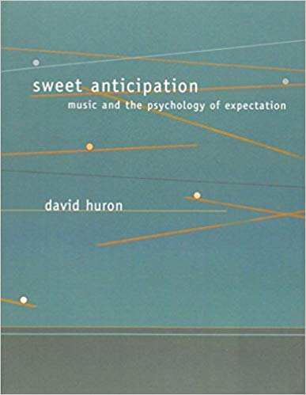
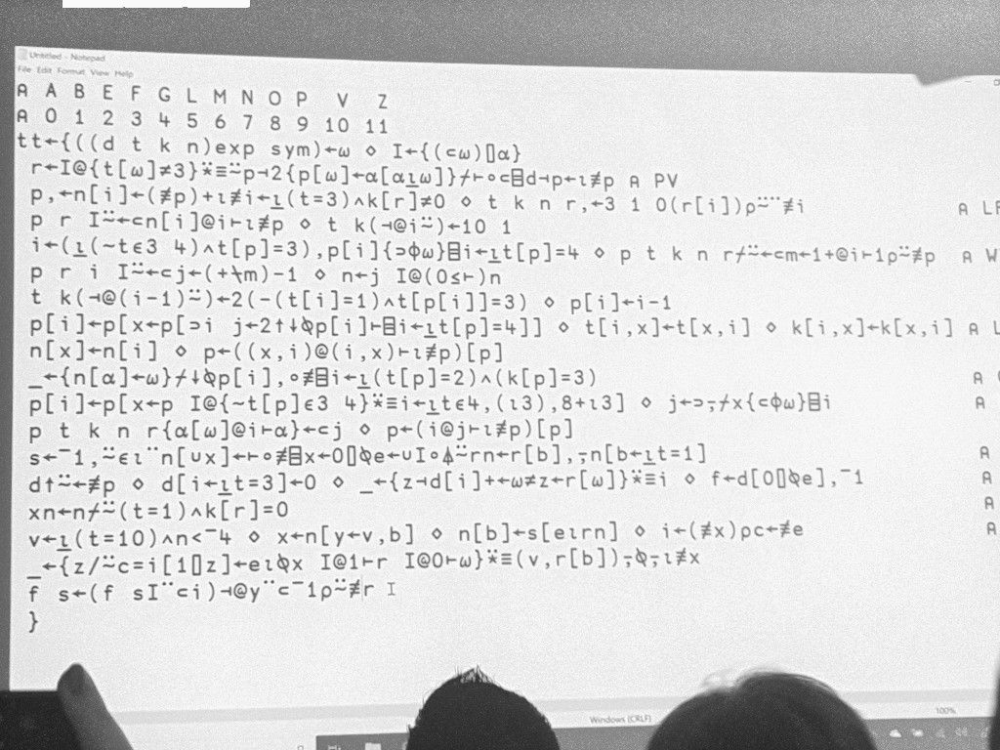
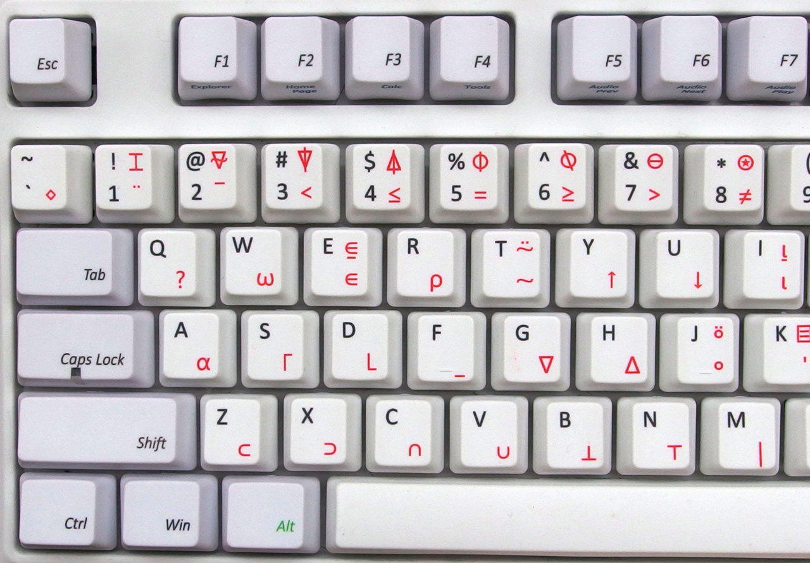

import { Head, Notes, Appear, Image } from 'mdx-deck'

export { theme } from './theme'


# Bob Konf 2019

* Small conference in Berlin focused on non-mainstream technologies
* Wide range of topics with focus on functional programming
* https://bobkonf.de/2019/en/program.html

---

# Summary

* Programming in Prolog
* Checking musical correctness by Chris Ford
* The way of APL by Aaron Hsu
* Modern SQL
* Accelerated haskell by Gabriele Keller


---

# Programming in Prolog

## Lars Hupel

* Prolog programs are sequences of rules (or clauses)
* Rules can have arguments
* Programs can be queried
* Anything not in the program is not true.

---

# Checking musical correctness

#### Chris Ford

* Is it possible to constrain how music should sound?
    - What parameters have an affect on how we percieve music?
    - How does music evoke emotions?



---

# Checking musical correctness


http://ctford.github.io/klangmeister/synthesis

* There are different views on composing music (prescriptivist vs descriptivist view):
  - There are rules for how music (should) be composed
    *(A jump from C to high B is wrong)*
  - If you follow best practices you are probably doing the right thing
    *(A jump from C to high B is rare)*

* In music: Entropy/complexity depends on change in pitch and duration of
  notes.

* The haskell framework Mezzo enforces rules to limit by adding dependent types
  that control how the melody can change. https://github.com/DimaSamoz/mezzo

* Another chris ford talk is one of the best technical talks I have seen: https://www.youtube.com/watch?v=Mfsnlbd-4xQ

---

# The way of APL

#### Aaron Hsu

---

A live-coded compiler in APL:



---



---

* Programming with multidimensional arrays

* Large range of graphic symbols resulting in alien like, cryptic code

* The following fidns all prime numbers between 1 and R:

Prime numbers in APL:

```
(~R∊R∘.×R)/R←1↓ιR
```

Conways game of life:
```
⍝ Create a 5x7 matrix with some random 1's
R←¯1 ⊖ ¯2 ⌽ 5 7 ↑ (3 3 ⍴ ⍳ 9) ∊ 2 3 4 5 7

⍝ Conways game of life function
{↑1 ⍵∨.∧3 4=+/,¯1 0 1∘.⊖¯1 0 1∘.⌽⊂⍵}
```

Online editor:

http://www.tryapl.org

APL 1975 presentation

https://www.youtube.com/watch?v=_DTpQ4Kk2wA

---

# Modern SQL

#### Markus Winland

* https://use-the-index-luke.com/

* Most people are using SQL 92, a version released at the same time as windows
  3.1
  - WITH  (non-recursive)
    - for flattening and simplifying nested queries
  - WITH RECURSIVE (querying your own queries)
    - traverse hierarchies
    - Produce test data (Row generators)
  - GROUP BY ... GROUPING SETS
    - combine multiple group by's
  - OVER
    - specify which rows aggregates should affect (etc running totals)


---

# Accelerated Haskell

## Gabrielle Keller

* https://hackage.haskell.org/package/accelerate

* Extremely fast and parallel embedded language in haskell with small overhead.

```
dotp :: Acc (Vector Float) -> Acc (Vector Float) -> Acc (Scalar Float)
dotp xs ys = fold (+) 0 (zipWith (*) xs ys)
```
